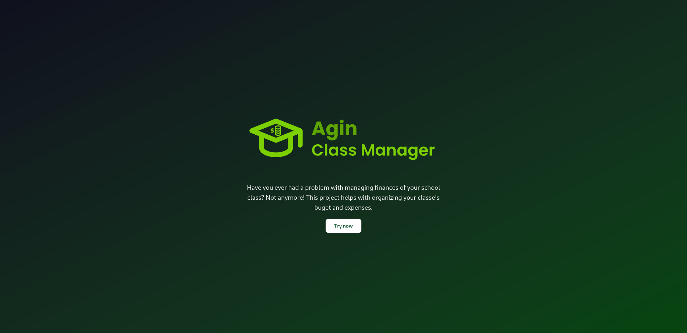
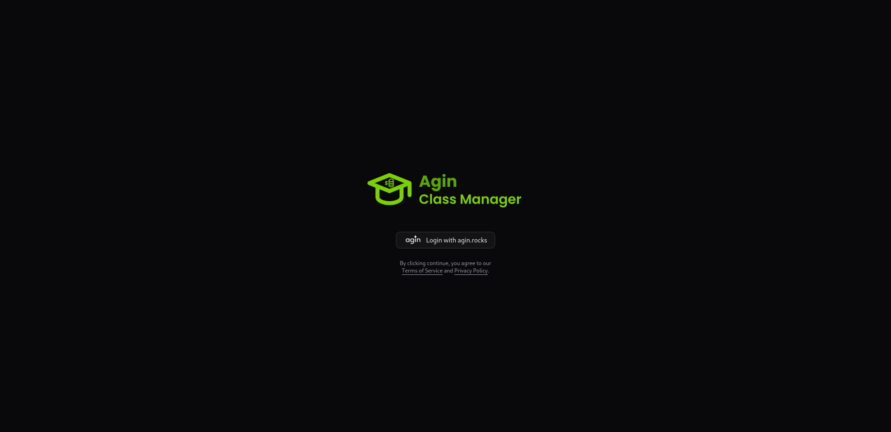
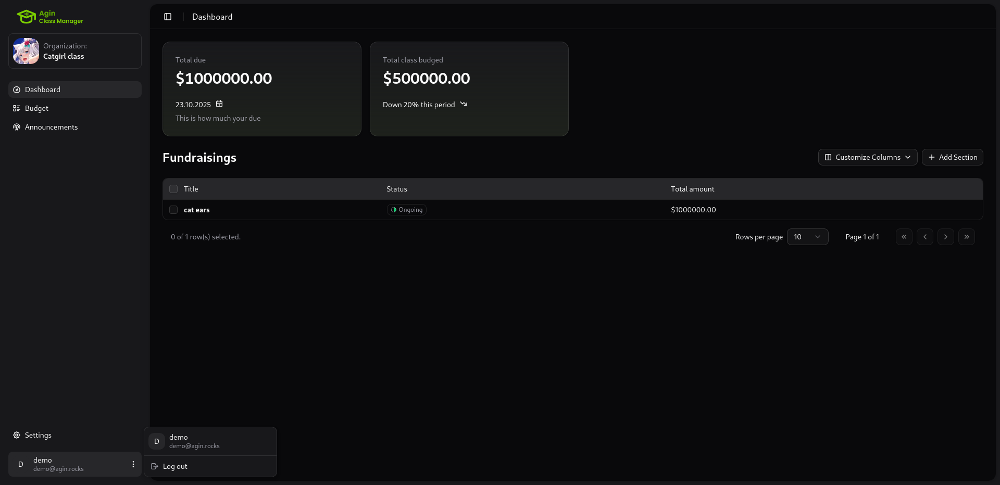
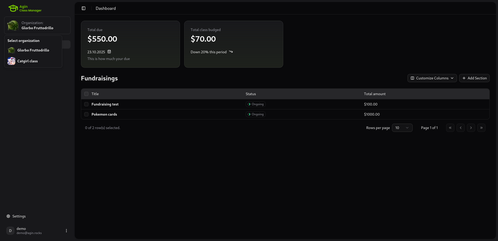

# Agin Class Manager

Have you ever had a problem with managing finances of your school class? Not anymore! This project helps with organizing your classe's buget and expenses.

In other words this is an app for class treasurers to make their life easier or smth.


## **Functions**

### **Working**:

- login with oidc
- logout
- switching between organizations
- dashboard view
- fundraisings list
- user details with avatar from gravatar
  
  
  
- creating an organization
- secret santa management
- organization settings

### **Somewhat working** _(this functions work but only over bare api)_:

- creating a fundraising
- adding a member to an organization

### **In progress** _(those are functions that are under development)_:

- detailed budget view
- transactions from organization view
- user settings
- editing organizations/fundraisings
- organization announcments system

## **Documentation**:

You can view all the enpoints that this api has [here](https://class.agin.rocks/apidoc/scalar)

## **Technologies**:

I built this project's frontend with [shadcn](https://ui.shadcn.com/) components

## Host it yourself:

You can host it by yourself with docker!

_If you want to use something different than traefik, you need to adjust compose file for your needs._

### Dependencies:

- [docker](https://docs.docker.com/engine/install/)
- [traefik](https://doc.traefik.io/traefik/getting-started/install-traefik/)

### Run:

#### You first need to edit config.toml file in repo's root folder, this file is mounted inside docker container.

You need to set oidc client and your public url for oidc to work properly.

```bash
docker compose up -d
```

## Development:

### Dependencies:

- [pnpm](https://pnpm.io/installation)
- [rust/cargo](https://rust-lang.org/tools/install/)
- [caddy](https://caddyserver.com/)
- [mongodb](https://www.mongodb.com/docs/manual/installation/)

### Run:

**web**

```bash
cd web/
pnpm i
pnpm dev
```

**api**

```bash
docker compose -f compose-dev.yaml up -d # This is for database and redis
cd api/
cargo run
```

**caddy** - mixing api and web together on one port

```bash
caddy run
```
